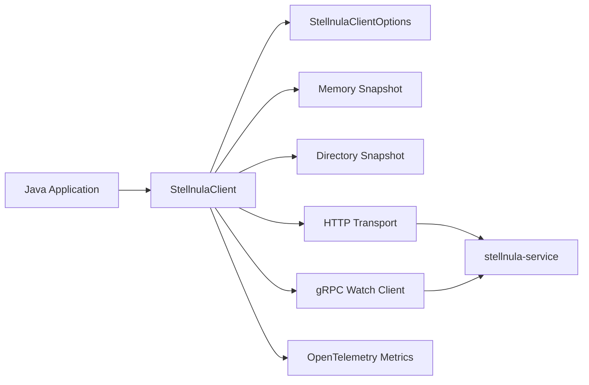
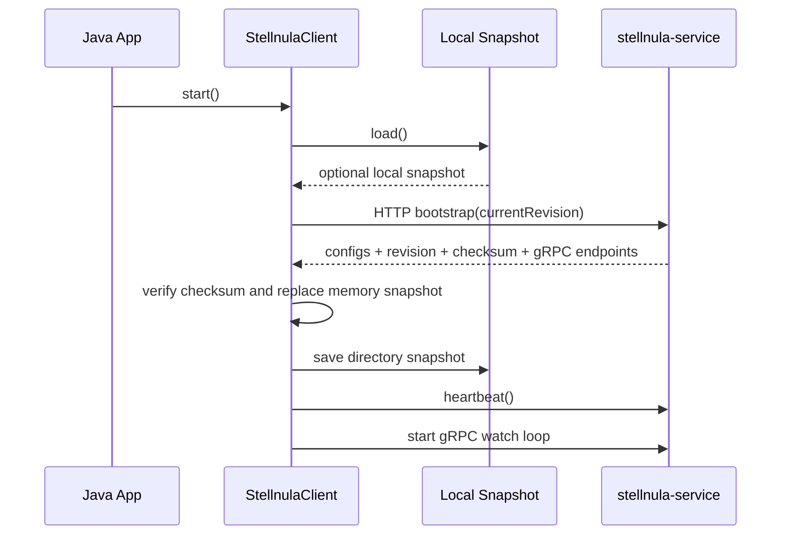
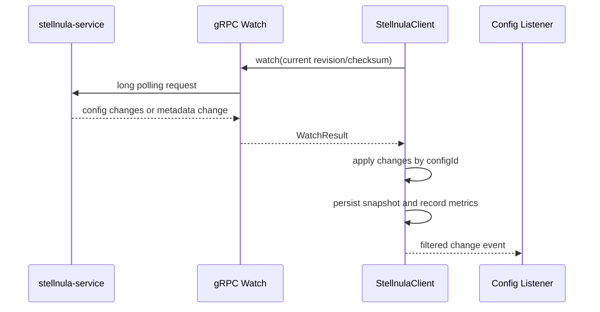

# StellNula Java SDK

[English](README_EN.md)

`stellnula-java-sdk` 是 StellNula 配置中心的纯 Java 客户端 SDK。它面向普通 Java 应用、平台组件以及后续 Spring Boot Starter，提供启动同步、配置读取、本地内存快照、本地目录快照、gRPC Watch、故障恢复、类型转换、前缀绑定、细粒度监听和 OpenTelemetry 指标采集能力。

本仓库只包含 SDK 核心能力，不引入 Spring Boot、Spring Framework 或任何自动装配依赖。Spring Boot Starter、运行时框架集成和配置装配逻辑应在独立模块中完成，并通过本 SDK 暴露的稳定 API 进行接入。

## 当前状态

| 项目 | 说明 |
| --- | --- |
| 稳定性 | 开发中 |
| Java 版本 | JDK 25 |
| 项目类型 | 配置中心 Java SDK |
| Maven 坐标 | `io.github.stellhub:stellnula-java-sdk` |
| 核心传输 | HTTP 数据面、gRPC Watch |
| 适用场景 | Java 应用、框架 Starter、平台中间件 |
| 维护方 | StellHub |

## 解决什么问题

- 应用启动时从 `stellnula-service` 拉取远端全量配置。
- 将配置写入本地内存快照，并按配置文件粒度落盘到本地快照目录。
- 通过 revision 和 checksum 感知配置版本，避免重复加载和脏数据。
- 使用 gRPC Watch 监听运行态变更，并在异常时回退到 HTTP 补偿同步。
- 对外提供 key 查询、类型转换、前缀绑定、变更监听和管理面 API。
- 接收外部传入的 OkHttpClient、ExecutorService 和 OpenTelemetry，方便框架统一治理连接池、线程池和可观测数据。

## 不解决什么问题

- 不提供 `stellnula-service` 服务端实现。
- 不直接提供 Spring Boot 自动装配、`EnvironmentPostProcessor` 或配置属性注入。
- 不实现配置管理控制台。
- 不把本地快照作为配置中心事实来源。本地快照只用于启动兜底和诊断。
- 不在 SDK 内部创建 OpenTelemetry SDK、MeterProvider 或 exporter。

## 核心能力

| 能力 | 说明 |
| --- | --- |
| Bootstrap | 启动时执行远端全量同步 |
| Config Read | 按 `configKey` 或 `configId` 读取配置 |
| Local Memory Snapshot | 使用不可变快照承载当前配置视图 |
| Local Directory Snapshot | 将每个配置内容写入本地 `configs/` 目录 |
| Revision and Checksum | 使用服务端 revision 与 checksum 校验一致性 |
| gRPC Watch | 长轮询监听配置变更 |
| Recovery | Watch 失败后执行 HTTP delta/full sync 补偿 |
| Listener | 支持全量、指定 key、指定 prefix 的变更监听 |
| Type Conversion | 支持 String、数字、Boolean、Duration 等常用类型转换 |
| Prefix Binding | 将前缀下的配置绑定成目标 Java 类型 |
| Telemetry | 接入外部 OpenTelemetry 并记录关键指标 |
| Management API | 提供配置、治理规则、灰度规则的基础管理接口 |

## 基本原理

StellNula SDK 的运行模型可以分为四层：

1. **客户端上下文**

   `StellnulaClientOptions` 描述当前客户端实例的身份和运行范围，包括 `appId`、`clientId`、`env`、`region`、`zone`、`cluster`、`namespace`、`group`、订阅列表、快照目录、超时、重试、线程池和可观测实例。

2. **远端同步**

   SDK 启动时先读取本地快照，再通过 HTTP bootstrap 拉取服务端全量配置。服务端返回配置集合、revision、checksum 和可选 gRPC 节点信息。SDK 会校验快照一致性，并把最新配置写入内存和本地目录。

3. **本地快照**

   内存中使用 `StellnulaSnapshot` 表示当前配置视图。每个配置项是一个 `StellnulaConfigEntry`，包含 `configId`、`configKey`、`contentType`、`configValue`、版本、灰度匹配信息、传输模式和作用域。对外读取时通常是 `configKey -> configValue`，内部增量合并使用更稳定的 `configId`。

4. **运行态变更**

   SDK 使用 gRPC Watch 监听服务端 revision 变化。收到变更后会应用增量、更新本地快照、通知 listener，并记录指标。如果 gRPC 节点不可用，SDK 会隔离失败节点并通过 HTTP delta/full sync 恢复。

## 架构



### 启动流程



### 运行态变更流程



## 核心概念

| 概念 | 说明 |
| --- | --- |
| `appId` | 应用标识，用于定位应用配置集合 |
| `clientId` | 客户端实例标识，建议每个进程唯一 |
| `env` | 环境，例如 `dev`、`uat`、`pre`、`prod` |
| `namespace` | 配置隔离空间，通常对应租户、业务域或环境隔离 |
| `group` | 配置分组。当前作为客户端默认 group，subscription 可指定 group |
| `configId` | 服务端配置唯一标识，内部增量合并优先使用 |
| `configKey` | 业务读取 key，也可表示文件路径，例如 `application/dev.yaml` |
| `configValue` | 解码后的配置内容。文件配置时可理解为文件内容 |
| `revision` | 服务端配置版本，用于判断是否需要同步 |
| `checksum` | 配置集合校验值，用于检测本地快照是否与服务端一致 |
| `subscription` | 客户端订阅过滤条件，支持全部配置或指定配置 |

## 快速开始

### Maven

```xml
<dependency>
    <groupId>io.github.stellhub</groupId>
    <artifactId>stellnula-java-sdk</artifactId>
    <version>0.0.2</version>
</dependency>
```

### 创建客户端并同步配置

```java
import io.github.stellnula.client.StellnulaClient;
import io.github.stellnula.client.StellnulaClientOptions;
import io.github.stellnula.config.StellnulaSnapshot;
import java.net.URI;
import java.nio.file.Path;
import java.time.Duration;
import okhttp3.OkHttpClient;

public final class StellnulaExample {

    public static void main(String[] args) throws Exception {
        OkHttpClient httpClient = new OkHttpClient.Builder().build();
        StellnulaClientOptions options = StellnulaClientOptions.builder()
                .endpoint(URI.create("http://localhost:8060"))
                .appId("stellhub.core.middleware.stellcloud.admin")
                .clientId("stellnula-java-sdk-demo")
                .env("dev")
                .namespace("default")
                .group("default")
                .requestTimeout(Duration.ofSeconds(5))
                .snapshotDirectory(Path.of(System.getProperty("user.home"), ".stellnula", "demo"))
                .build();

        try (StellnulaClient client = new StellnulaClient(options, httpClient)) {
            StellnulaSnapshot snapshot = client.syncNow();
            System.out.println("revision=" + snapshot.revision());
            client.asMap().forEach((key, value) -> System.out.println(key + "=" + value));
        }
    }
}
```

### 启动 Watch

```java
try (StellnulaClient client = new StellnulaClient(options, httpClient)) {
    client.start();
    String serverPort = client.getRequiredValue("server.port");
    System.out.println("server.port=" + serverPort);
}
```

`start()` 会先加载本地快照，再执行远端同步，并在 `watchEnabled=true` 时启动 gRPC Watch 循环。

## 读取配置

```java
String required = client.getRequiredValue("server.port");
int port = client.getInt("server.port").orElse(8080);
boolean enabled = client.getBoolean("feature.enabled").orElse(false);
Duration timeout = client.getDuration("http.timeout").orElse(Duration.ofSeconds(3));
```

## Prefix Binding

当远端配置类似如下：

```properties
server.port=8080
server.host=127.0.0.1
server.shutdown-timeout=5s
```

可以按前缀绑定：

```java
public record ServerProperties(int port, String host, Duration shutdownTimeout) {}

ServerProperties properties = client.bindPrefix("server", ServerProperties.class);
```

## 监听配置变更

```java
client.listenPrefix("server", event -> {
    event.changes().forEach(change -> {
        System.out.println(change.entry().configKey() + ": "
                + change.previousValue() + " -> " + change.currentValue());
    });
});
```

SDK 支持：

- `listen(listener)`：监听全部变更。
- `listenKey(key, listener)`：监听指定 `configKey` 或 `configId`。
- `listenPrefix(prefix, listener)`：监听指定前缀。
- `listen(predicate, listener, notifyCurrent)`：自定义过滤条件，并可选择是否立即通知当前快照。

## 本地快照

默认快照目录：

```text
${user.home}/.stellnula/${appId}/${env}/${cluster}
```

目录结构：

```text
${snapshotDirectory}/
├── .stellnula-snapshot.json
└── configs/
    ├── server.port
    └── application/
        └── dev.yaml
```

其中：

- `.stellnula-snapshot.json` 保存 revision、checksum 和配置索引。
- `configs/` 保存每个配置项的真实内容。
- 文件路径优先来自 `configKey`，不安全路径会被清理或回退到 `by-id/`。
- 旧版 `config-snapshot.json` 仍可读取，下一次保存会迁移为目录快照。

## 配置项

| 配置项 | 默认值 | 说明 |
| --- | --- | --- |
| `endpoint` | 无 | `stellnula-service` HTTP 地址，必填 |
| `grpcEndpoint` | 服务端返回或空 | 指定 gRPC Watch 地址 |
| `grpcPlaintext` | `true` | gRPC 是否使用明文连接 |
| `apiToken` | 空 | 固定访问令牌 |
| `tokenProvider` | fixed token | 动态令牌提供器 |
| `appId` | `default-app` | 应用标识 |
| `clientId` | `default-client` | 客户端实例标识 |
| `env` | `dev` | 环境 |
| `region` | `default` | 区域 |
| `zone` | `default` | 可用区 |
| `cluster` | `default` | 集群 |
| `namespace` | `default` | 配置命名空间 |
| `group` | `default` | 默认配置分组 |
| `subscriptions` | 空列表 | 订阅过滤条件 |
| `snapshotDirectory` | `${user.home}/.stellnula/${appId}/${env}/${cluster}` | 本地快照目录 |
| `requestTimeout` | 10s | HTTP 请求超时 |
| `watchTimeout` | 30s | Watch 等待超时 |
| `retryDelay` | 3s | 默认重试间隔 |
| `serverRefreshInterval` | 1m | 服务端节点刷新间隔 |
| `serverFailureCooldown` | 30s | 失败节点隔离时间 |
| `grpcShutdownTimeout` | 3s | gRPC channel 关闭等待时间 |
| `watchEnabled` | `true` | 是否启动 Watch |
| `failFastOnBootstrap` | `false` | 启动同步失败时是否直接抛出 |
| `pageSize` | 500 | 服务端分页大小 |
| `maxPayloadBytes` | 0 | 最大载荷限制，0 表示不限制 |
| `acceptLargeFileReference` | `false` | 是否接受大文件引用模式 |
| `openTelemetry` | noop | 外部传入的 OpenTelemetry 实例 |

## 线程池与连接池

SDK 推荐由框架或应用传入统一管理的资源：

```java
import io.github.stellnula.client.StellnulaClient;
import io.github.stellnula.client.StellnulaClientOptions;
import java.util.concurrent.ExecutorService;
import java.util.concurrent.Executors;
import okhttp3.OkHttpClient;

OkHttpClient httpClient = new OkHttpClient.Builder().build();
ExecutorService watchExecutor = Executors.newSingleThreadExecutor();
ExecutorService listenerExecutor = Executors.newFixedThreadPool(2);

StellnulaClient client = new StellnulaClient(
        options,
        httpClient,
        watchExecutor,
        listenerExecutor);
```

当外部传入线程池时，SDK 不会在 `close()` 时关闭这些线程池，调用方需要自行管理生命周期。

## 可观测性

SDK 只消费 `StellnulaClientOptions.openTelemetry(OpenTelemetry)` 传入的框架级实例，默认使用 noop。这样可以让指标由应用或框架统一导出到 Prometheus、OTLP Collector 或其他后端。

当前记录的核心指标包括：

| 指标 | 类型 | 说明 |
| --- | --- | --- |
| `stellnula.client.operations` | Counter | 客户端操作次数 |
| `stellnula.client.operation.duration` | Histogram | 客户端操作耗时 |
| `stellnula.client.errors` | Counter | 客户端错误次数 |
| `stellnula.client.config.changes` | Counter | 配置变更数量 |
| `stellnula.client.snapshot.operations` | Counter | 本地快照操作次数 |
| `stellnula.client.snapshot.operation.duration` | Histogram | 本地快照操作耗时 |
| `stellnula.client.listener.notifications` | Counter | listener 通知次数 |
| `stellnula.client.revision` | Gauge | 当前配置 revision |
| `stellnula.client.config.entries` | Gauge | 当前配置项数量 |

## 管理面 API

SDK 还提供基础管理接口，便于平台工具或测试代码操作配置：

- 查询、创建、更新、删除配置。
- 复制公共配置。
- 查询和维护治理规则。
- 查询、创建、结束灰度规则。
- 查询灰度影响范围。

管理面 API 与运行态客户端能力共享同一个 `StellnulaClient`，但生产应用通常只需要读取与 Watch 能力。

## 本地真实服务测试

仓库包含一个连接本地 `stellnula-service` 的测试：

```bash
mvn -q -Dtest=StellnulaClientTest#connectsLocalStellnulaServiceAndPrintsKeyValues test
```

默认连接：

```text
http://localhost:8060
appId=stellhub.core.middleware.stellcloud.admin
env=dev
namespace=default
group=default
```

如需覆盖本地参数：

```bash
mvn -q -Dtest=StellnulaClientTest#connectsLocalStellnulaServiceAndPrintsKeyValues test \
  -Dstellnula.local.env=dev \
  -Dstellnula.local.namespace=default \
  -Dstellnula.local.cluster=default \
  -Dstellnula.local.group=default \
  -Dstellnula.local.token=your-token
```

如果 `localhost:8060` 未启动，测试会自动跳过。

## 故障排查

### 启动拿不到配置

1. 检查 `endpoint` 是否指向正确的 `stellnula-service`。
2. 检查 `appId`、`env`、`namespace`、`group` 是否与服务端发布记录一致。
3. 检查服务端是否已发布目标 revision。
4. 检查本地快照目录是否可读写。
5. 检查访问令牌是否过期，或 `tokenProvider` 是否能返回新 token。

### Watch 不触发

1. 检查服务端返回或手动配置的 `grpcEndpoint`。
2. 检查网络、防火墙和 gRPC 明文/TLS 设置。
3. 检查服务端 revision 是否真实变化。
4. 检查 listener 是否被 key 或 prefix 过滤掉。

### 本地快照被隔离为 `.corrupt`

SDK 在发现本地 metadata 无法解析或 checksum 不匹配时，会将文件移动为 `.corrupt`，然后回退到远端同步。可以检查 `.corrupt` 文件判断是否存在磁盘损坏、手工编辑或跨版本格式不兼容。

## 安全建议

- 生产环境不要将本地快照目录提交到仓库。
- 本地快照可能包含敏感配置，应按操作系统规范设置文件权限。
- 建议通过 `StellnulaTokenProvider` 接入框架级 token 刷新逻辑。
- 不建议在业务日志中直接打印完整配置值，尤其是密钥、连接串和证书。

## 本地开发

```bash
mvn clean verify
mvn -q test
mvn -q spotless:check
```

涉及以下能力的改动应补充测试：

- 启动同步和 HTTP 协议解析。
- gRPC Watch、节点刷新和故障隔离。
- 本地快照读写、checksum 校验和兼容迁移。
- 类型转换、prefix binding 和 listener。
- OpenTelemetry 指标。

## 项目结构

```text
.
├── pom.xml
├── README.md
├── README_EN.md
└── src/
    ├── main/java/io/github/stellnula/
    │   ├── auth/
    │   ├── client/
    │   ├── config/
    │   ├── grpc/
    │   ├── internal/
    │   ├── management/
    │   ├── store/
    │   ├── telemetry/
    │   └── transport/
    └── test/
```

## 兼容性说明

- `snapshotDirectory(Path)` 是推荐的本地快照配置方式。
- `snapshotFile(Path)` 已保留为 deprecated 兼容入口，会映射到父目录。
- SDK 当前不引入 Spring 相关依赖，后续 Spring Boot Starter 应作为独立模块接入。
- `ObjectMapper` 使用 SDK 内部共享实例，不建议调用方依赖内部 JSON 实现细节。

## 贡献规范

- 公共 API、配置模型或协议语义变更必须说明兼容性影响。
- Watch、快照和故障恢复逻辑变更必须补充测试。
- 行为变更必须同步更新 README 或扩展文档。
- 不要在 SDK 核心模块中引入 Spring Boot 相关依赖。

## 许可证

本项目在 `pom.xml` 中声明 Apache License 2.0。
