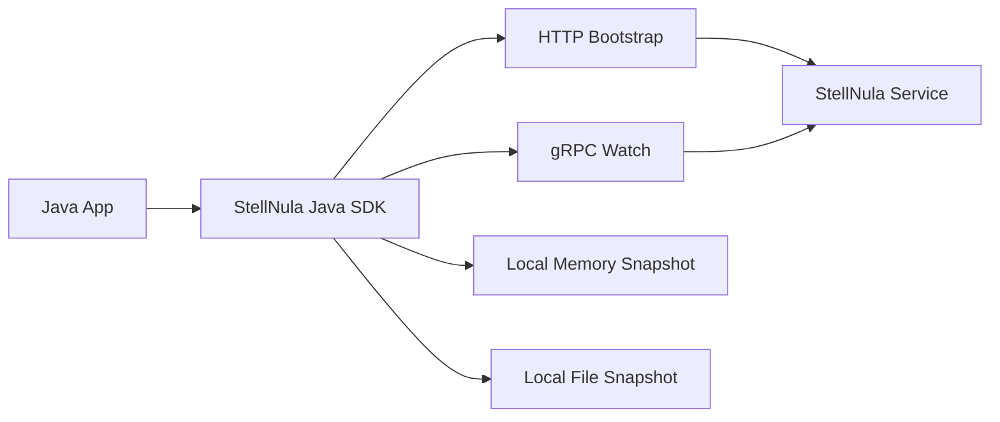

# StellNula Java SDK

`stellnula-java-sdk` 是 StellNula 配置中心的 Java 客户端 SDK，面向普通 Java 应用和后续 Spring Boot Starter，提供配置启动同步、远端配置读取、本地快照、运行态变更订阅和故障恢复能力。

## 项目概述

本仓库只包含纯 Java SDK，不引入 Spring Boot、Spring Framework 或自动装配依赖。SDK 负责对接 `stellnula-service` 客户端数据面和 gRPC Watch 长轮询接口，并为上层框架提供可包装的核心 API。

## 当前状态

| 项目 | 说明 |
| --- | --- |
| 稳定性 | 开发中 |
| 项目类型 | Java 配置中心 SDK |
| 适用对象 | Java 应用、框架 Starter、平台组件 |
| 核心能力 | 配置拉取、本地快照、Watch、故障恢复 |
| 维护方 | StellHub |

## 解决什么问题

- 应用启动时强制拉取远端全量配置。
- 将远端配置写入本地内存快照和本地文件快照。
- 支持运行态配置变更订阅。
- 支持基于 revision 的增量感知。
- 为后续 Spring Boot Starter 提供核心客户端能力。

## 不解决什么问题

- 不提供配置中心服务端能力。
- 不直接提供 Spring Boot 自动装配。
- 不实现配置管理控制台。
- 不把本地文件作为服务端事实来源。

## 核心能力

| 能力 | 说明 |
| --- | --- |
| Bootstrap | 启动时拉取全量配置 |
| Config Client | 读取远端配置内容 |
| Local Snapshot | 维护本地内存和文件快照 |
| Watch | 订阅运行态配置变更 |
| Revision | 根据版本感知变更 |
| Telemetry | 暴露客户端运行指标 |

## 架构说明



## 快速开始

```xml
<dependency>
    <groupId>io.github.stellhub</groupId>
    <artifactId>stellnula-java-sdk</artifactId>
    <version>${stellnula.version}</version>
</dependency>
```

```java
StellnulaClient client = StellnulaClient.create(config);
ConfigSnapshot snapshot = client.bootstrap();
```

## 配置说明

| 配置项 | 是否必填 | 说明 |
| --- | --- | --- |
| stellnula.endpoint | 是 | 服务端 HTTP 地址 |
| stellnula.grpc.endpoint | 是 | Watch gRPC 地址 |
| stellnula.app | 是 | 应用标识 |
| stellnula.env | 是 | 环境 |
| stellnula.snapshot.path | 否 | 本地快照文件路径 |

## 本地开发

```bash
mvn clean verify
```

涉及启动同步、Watch、本地快照和故障恢复的改动必须补充测试。

## 版本与升级

- `MAJOR`：不兼容 API、配置模型或 Watch 协议变更。
- `MINOR`：向后兼容的新能力。
- `PATCH`：向后兼容的问题修复。

## 可观测性

| 类型 | 名称 | 说明 |
| --- | --- | --- |
| Metric | stellnula_client_bootstrap_total | 启动同步次数 |
| Metric | stellnula_client_watch_total | Watch 请求次数 |
| Metric | stellnula_client_snapshot_write_total | 快照写入次数 |
| Log | BOOTSTRAP_FAILED | 启动同步失败 |
| Log | WATCH_RECONNECT | Watch 重新发起 |

## 故障排查

### 应用启动拿不到配置

1. 检查 HTTP endpoint 是否正确。
2. 检查 app、env 和 namespace 是否匹配。
3. 检查本地快照文件是否可读。
4. 检查服务端是否已发布对应配置版本。

## 安全说明

本地快照文件需要按平台规范设置访问权限，生产环境配置不应直接提交到仓库。

## 目录结构

```text
.
├── src/            # SDK 源码
├── docs/           # 扩展文档
├── pom.xml         # Maven 构建文件
└── README.md       # 项目说明
```

## 贡献规范

- 公共 API 和配置模型变更必须说明兼容性影响。
- Watch、快照和故障恢复逻辑变更必须补充测试。
- 行为变更必须同步更新 README 或 docs。

## 支持

由 StellHub 维护。建议通过 GitHub Issues 记录问题、需求和设计讨论。

## 许可证

以仓库内 `LICENSE` 文件为准。