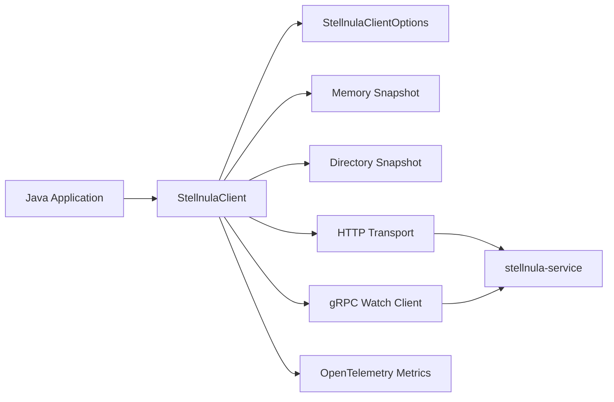
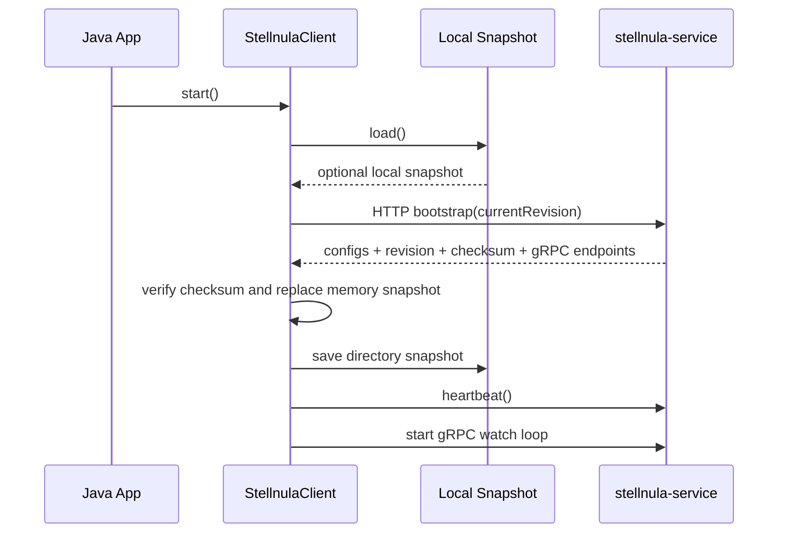
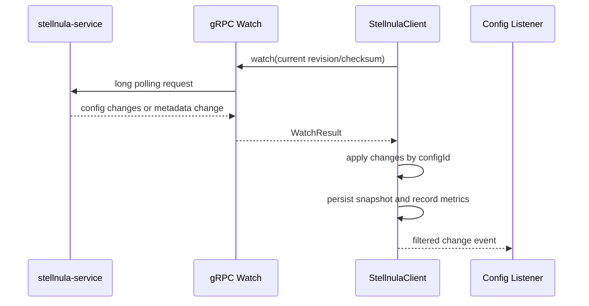

# StellNula Java SDK

[中文](README.md)

`stellnula-java-sdk` is the pure Java client SDK for the StellNula configuration center. It is designed for plain Java applications, platform components, and a future Spring Boot Starter. The SDK provides startup synchronization, remote configuration reads, local in-memory snapshots, local directory snapshots, gRPC Watch, failure recovery, type conversion, prefix binding, fine-grained listeners, and OpenTelemetry metrics.

This repository contains only the core SDK. It does not depend on Spring Boot, Spring Framework, or any auto-configuration mechanism. Spring Boot integration, runtime framework wiring, and property-source adaptation should live in a separate starter module built on top of this SDK.

## Status

| Item | Description |
| --- | --- |
| Stability | In development |
| Java version | JDK 25 |
| Project type | Configuration center Java SDK |
| Maven coordinates | `io.github.stellhub:stellnula-java-sdk` |
| Core transports | HTTP data plane, gRPC Watch |
| Target users | Java applications, framework starters, platform middleware |
| Maintainer | StellHub |

## What This SDK Solves

- Fetches a full remote configuration snapshot from `stellnula-service` during application startup.
- Stores configuration in an in-memory snapshot and persists each config item into a local snapshot directory.
- Uses revision and checksum to detect stale or inconsistent data.
- Watches runtime changes through gRPC Watch and falls back to HTTP recovery when needed.
- Exposes key reads, type conversion, prefix binding, change listeners, and management APIs.
- Accepts externally managed OkHttpClient, ExecutorService, and OpenTelemetry instances so frameworks can manage connection pools, thread pools, and telemetry export consistently.

## What This SDK Does Not Solve

- It does not implement `stellnula-service`.
- It does not provide Spring Boot auto-configuration, `EnvironmentPostProcessor`, or property injection.
- It does not implement a configuration management console.
- It does not treat local snapshots as the source of truth. Local snapshots are a startup fallback and diagnostic artifact.
- It does not create OpenTelemetry SDKs, MeterProviders, or exporters internally.

## Features

| Feature | Description |
| --- | --- |
| Bootstrap | Fetches a full snapshot during startup |
| Config Read | Reads config values by `configKey` or `configId` |
| Local Memory Snapshot | Keeps the current configuration view as an immutable snapshot |
| Local Directory Snapshot | Persists each config item under a local `configs/` directory |
| Revision and Checksum | Validates consistency with server revision and checksum |
| gRPC Watch | Long-polls runtime configuration changes |
| Recovery | Falls back to HTTP delta/full sync when Watch fails |
| Listener | Supports all-change, key-based, and prefix-based listeners |
| Type Conversion | Converts values to String, numbers, Boolean, Duration, and more |
| Prefix Binding | Binds config values under a prefix to a Java type |
| Telemetry | Records metrics through an externally provided OpenTelemetry instance |
| Management API | Provides basic config, governance-rule, and gray-rule management calls |

## Core Principles

The SDK runtime model has four layers:

1. **Client context**

   `StellnulaClientOptions` describes the identity and runtime scope of a client instance, including `appId`, `clientId`, `env`, `region`, `zone`, `cluster`, `namespace`, `group`, subscriptions, snapshot directory, timeouts, retry settings, executors, and telemetry.

2. **Remote synchronization**

   On startup, the SDK loads the local snapshot first, then performs an HTTP bootstrap against the server. The server returns config entries, revision, checksum, and optional gRPC endpoints. The SDK verifies consistency and writes the latest state to memory and disk.

3. **Local snapshot**

   The current configuration view is represented by `StellnulaSnapshot`. Each config item is a `StellnulaConfigEntry` containing `configId`, `configKey`, `contentType`, `configValue`, version, gray-match metadata, delivery mode, and scope. Public reads are usually `configKey -> configValue`, while internal delta merging uses the more stable `configId`.

4. **Runtime changes**

   The SDK uses gRPC Watch to observe server-side revision changes. When changes arrive, it applies the delta, updates local snapshots, notifies listeners, and records metrics. If a gRPC node fails, the SDK isolates the failed node and recovers through HTTP delta/full sync.

## Architecture



### Startup Flow



### Runtime Change Flow



## Concepts

| Concept | Description |
| --- | --- |
| `appId` | Application identifier used to locate the application's config set |
| `clientId` | Client instance identifier, preferably unique per process |
| `env` | Environment such as `dev`, `uat`, `pre`, or `prod` |
| `namespace` | Configuration isolation scope, often used for tenant, domain, or environment isolation |
| `group` | Configuration group. Currently used as the default client group; subscriptions can specify their own group |
| `configId` | Server-side unique config identifier, preferred for internal delta merging |
| `configKey` | Business-facing read key; it can also represent a file path such as `application/dev.yaml` |
| `configValue` | Decoded configuration content. For file configs, this is the file content |
| `revision` | Server-side configuration version used to decide whether synchronization is needed |
| `checksum` | Config-set checksum used to detect local/server inconsistency |
| `subscription` | Client-side subscription filter for all configs or selected configs |

## Quick Start

### Maven

```xml
<dependency>
    <groupId>io.github.stellhub</groupId>
    <artifactId>stellnula-java-sdk</artifactId>
    <version>0.0.2</version>
</dependency>
```

### Create a Client and Sync Configs

```java
import io.github.stellnula.client.StellnulaClient;
import io.github.stellnula.client.StellnulaClientOptions;
import io.github.stellnula.config.StellnulaSnapshot;
import java.net.URI;
import java.nio.file.Path;
import java.time.Duration;
import okhttp3.OkHttpClient;

public final class StellnulaExample {

    public static void main(String[] args) throws Exception {
        OkHttpClient httpClient = new OkHttpClient.Builder().build();
        StellnulaClientOptions options = StellnulaClientOptions.builder()
                .endpoint(URI.create("http://localhost:8060"))
                .appId("stellhub.core.middleware.stellcloud.admin")
                .clientId("stellnula-java-sdk-demo")
                .env("dev")
                .namespace("default")
                .group("default")
                .requestTimeout(Duration.ofSeconds(5))
                .snapshotDirectory(Path.of(System.getProperty("user.home"), ".stellnula", "demo"))
                .build();

        try (StellnulaClient client = new StellnulaClient(options, httpClient)) {
            StellnulaSnapshot snapshot = client.syncNow();
            System.out.println("revision=" + snapshot.revision());
            client.asMap().forEach((key, value) -> System.out.println(key + "=" + value));
        }
    }
}
```

### Start Watch

```java
try (StellnulaClient client = new StellnulaClient(options, httpClient)) {
    client.start();
    String serverPort = client.getRequiredValue("server.port");
    System.out.println("server.port=" + serverPort);
}
```

`start()` loads the local snapshot first, synchronizes with the remote server, and starts the gRPC Watch loop when `watchEnabled=true`.

## Reading Values

```java
String required = client.getRequiredValue("server.port");
int port = client.getInt("server.port").orElse(8080);
boolean enabled = client.getBoolean("feature.enabled").orElse(false);
Duration timeout = client.getDuration("http.timeout").orElse(Duration.ofSeconds(3));
```

## Prefix Binding

Given remote configuration like:

```properties
server.port=8080
server.host=127.0.0.1
server.shutdown-timeout=5s
```

You can bind values under a prefix:

```java
public record ServerProperties(int port, String host, Duration shutdownTimeout) {}

ServerProperties properties = client.bindPrefix("server", ServerProperties.class);
```

## Listening for Changes

```java
client.listenPrefix("server", event -> {
    event.changes().forEach(change -> {
        System.out.println(change.entry().configKey() + ": "
                + change.previousValue() + " -> " + change.currentValue());
    });
});
```

Supported listener modes:

- `listen(listener)`: listens for all changes.
- `listenKey(key, listener)`: listens for a single `configKey` or `configId`.
- `listenPrefix(prefix, listener)`: listens for a prefix.
- `listen(predicate, listener, notifyCurrent)`: uses a custom predicate and optionally emits the current snapshot immediately.

## Local Snapshot

Default snapshot directory:

```text
${user.home}/.stellnula/${appId}/${env}/${cluster}
```

Directory layout:

```text
${snapshotDirectory}/
├── .stellnula-snapshot.json
└── configs/
    ├── server.port
    └── application/
        └── dev.yaml
```

Details:

- `.stellnula-snapshot.json` stores revision, checksum, and config indexes.
- `configs/` stores the actual content of each config item.
- File paths prefer `configKey`; unsafe paths are sanitized or moved under `by-id/`.
- Legacy `config-snapshot.json` can still be read and will naturally migrate to the directory format on the next save.

## Options

| Option | Default | Description |
| --- | --- | --- |
| `endpoint` | none | HTTP endpoint of `stellnula-service`, required |
| `grpcEndpoint` | server-provided or empty | Explicit gRPC Watch endpoint |
| `grpcPlaintext` | `true` | Whether to use plaintext gRPC |
| `apiToken` | empty | Fixed access token |
| `tokenProvider` | fixed token | Dynamic token provider |
| `appId` | `default-app` | Application identifier |
| `clientId` | `default-client` | Client instance identifier |
| `env` | `dev` | Environment |
| `region` | `default` | Region |
| `zone` | `default` | Zone |
| `cluster` | `default` | Cluster |
| `namespace` | `default` | Configuration namespace |
| `group` | `default` | Default configuration group |
| `subscriptions` | empty list | Subscription filters |
| `snapshotDirectory` | `${user.home}/.stellnula/${appId}/${env}/${cluster}` | Local snapshot directory |
| `requestTimeout` | 10s | HTTP request timeout |
| `watchTimeout` | 30s | Watch wait timeout |
| `retryDelay` | 3s | Default retry delay |
| `serverRefreshInterval` | 1m | Server endpoint refresh interval |
| `serverFailureCooldown` | 30s | Failed endpoint isolation duration |
| `grpcShutdownTimeout` | 3s | gRPC channel shutdown timeout |
| `watchEnabled` | `true` | Whether Watch is enabled |
| `failFastOnBootstrap` | `false` | Whether startup should fail immediately when bootstrap fails |
| `pageSize` | 500 | Server-side page size |
| `maxPayloadBytes` | 0 | Max payload size; 0 means unlimited |
| `acceptLargeFileReference` | `false` | Whether to accept large-file reference delivery |
| `openTelemetry` | noop | Externally provided OpenTelemetry instance |

## Thread Pools and Connection Pools

The SDK works best when frameworks or applications provide centrally managed resources:

```java
import io.github.stellnula.client.StellnulaClient;
import io.github.stellnula.client.StellnulaClientOptions;
import java.util.concurrent.ExecutorService;
import java.util.concurrent.Executors;
import okhttp3.OkHttpClient;

OkHttpClient httpClient = new OkHttpClient.Builder().build();
ExecutorService watchExecutor = Executors.newSingleThreadExecutor();
ExecutorService listenerExecutor = Executors.newFixedThreadPool(2);

StellnulaClient client = new StellnulaClient(
        options,
        httpClient,
        watchExecutor,
        listenerExecutor);
```

When executors are provided externally, the SDK will not shut them down in `close()`. The caller owns their lifecycle.

## Observability

The SDK only consumes the `OpenTelemetry` instance passed through `StellnulaClientOptions.openTelemetry(OpenTelemetry)`. By default it uses noop. This allows applications and frameworks to export metrics consistently to Prometheus, OTLP Collector, or other backends.

Core metrics:

| Metric | Type | Description |
| --- | --- | --- |
| `stellnula.client.operations` | Counter | Number of client operations |
| `stellnula.client.operation.duration` | Histogram | Client operation duration |
| `stellnula.client.errors` | Counter | Number of client errors |
| `stellnula.client.config.changes` | Counter | Number of config changes |
| `stellnula.client.snapshot.operations` | Counter | Number of local snapshot operations |
| `stellnula.client.snapshot.operation.duration` | Histogram | Local snapshot operation duration |
| `stellnula.client.listener.notifications` | Counter | Number of listener notifications |
| `stellnula.client.revision` | Gauge | Current config revision |
| `stellnula.client.config.entries` | Gauge | Number of config entries in memory |

## Management APIs

The SDK also exposes basic management APIs for platform tooling and tests:

- Get, create, update, and delete configs.
- Replicate public configs.
- Get and maintain governance rules.
- Get, create, and end gray rules.
- Query gray-rule impact.

Management APIs share the same `StellnulaClient`, but production applications usually only need config read and Watch capabilities.

## Local Service Test

The repository includes a test that connects to a local `stellnula-service`:

```bash
mvn -q -Dtest=StellnulaClientTest#connectsLocalStellnulaServiceAndPrintsKeyValues test
```

Default target:

```text
http://localhost:8060
appId=stellhub.core.middleware.stellcloud.admin
env=dev
namespace=default
group=default
```

Override local parameters:

```bash
mvn -q -Dtest=StellnulaClientTest#connectsLocalStellnulaServiceAndPrintsKeyValues test \
  -Dstellnula.local.env=dev \
  -Dstellnula.local.namespace=default \
  -Dstellnula.local.cluster=default \
  -Dstellnula.local.group=default \
  -Dstellnula.local.token=your-token
```

If `localhost:8060` is not running, the test is skipped.

## Troubleshooting

### No Configs During Startup

1. Verify that `endpoint` points to the correct `stellnula-service`.
2. Verify that `appId`, `env`, `namespace`, and `group` match the server-side release.
3. Verify that the server has published the target revision.
4. Verify that the local snapshot directory is readable and writable.
5. Verify that the access token is valid or that `tokenProvider` can refresh it.

### Watch Does Not Trigger

1. Verify the server-provided or manually configured `grpcEndpoint`.
2. Check network, firewall, and gRPC plaintext/TLS settings.
3. Verify that the server revision actually changed.
4. Verify that the listener is not filtered out by key or prefix.

### Local Snapshot Is Quarantined as `.corrupt`

When local metadata cannot be parsed or checksum verification fails, the SDK moves the file to `.corrupt` and falls back to remote synchronization. Inspect the `.corrupt` file to determine whether the root cause is disk corruption, manual edits, or incompatible snapshot formats.

## Security Notes

- Do not commit local snapshot directories to source control.
- Local snapshots may contain sensitive values. Use proper operating-system file permissions.
- Prefer `StellnulaTokenProvider` for framework-managed token refresh.
- Avoid logging full config values in production, especially secrets, connection strings, and certificates.

## Local Development

```bash
mvn clean verify
mvn -q test
mvn -q spotless:check
```

Changes in the following areas should include tests:

- Startup synchronization and HTTP protocol parsing.
- gRPC Watch, endpoint refresh, and failure isolation.
- Local snapshot read/write, checksum validation, and compatibility migration.
- Type conversion, prefix binding, and listeners.
- OpenTelemetry metrics.

## Project Structure

```text
.
├── pom.xml
├── README.md
├── README_EN.md
└── src/
    ├── main/java/io/github/stellnula/
    │   ├── auth/
    │   ├── client/
    │   ├── config/
    │   ├── grpc/
    │   ├── internal/
    │   ├── management/
    │   ├── store/
    │   ├── telemetry/
    │   └── transport/
    └── test/
```

## Compatibility Notes

- `snapshotDirectory(Path)` is the recommended local snapshot option.
- `snapshotFile(Path)` is kept as a deprecated compatibility entry and maps to its parent directory.
- The SDK core module does not depend on Spring. A future Spring Boot Starter should be implemented as a separate module.
- The SDK uses an internal shared `ObjectMapper`; callers should not depend on internal JSON implementation details.

## Contributing

- Public API, configuration-model, or protocol-semantic changes must document compatibility impact.
- Watch, snapshot, and recovery changes must include tests.
- Behavior changes must update README or extended documentation.
- Do not introduce Spring Boot dependencies into the SDK core module.

## License

This project declares Apache License 2.0 in `pom.xml`.
